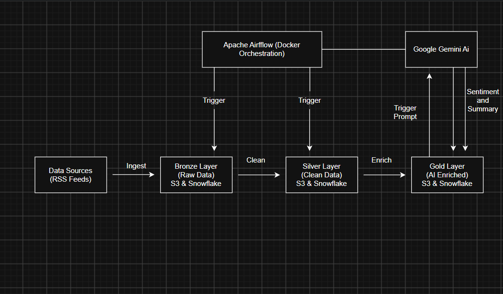

# 📰 AI-Powered News Data Pipeline (Medallion Architecture)



## 📌 Project Overview
This project is a fully automated, end-to-end Data Engineering pipeline built using the **Medallion Architecture** (Bronze, Silver, Gold). It orchestrates the ingestion of raw RSS news feeds, cleans and standardizes the data, and uses **Google Gemini Generative AI** to enrich the data with sentiment analysis and AI-generated summaries. The entire workflow is automated using **Apache Airflow** containerized via **Docker**.

## 🏗️ Architecture & Data Flow

Our pipeline follows a strict Medallion Architecture ensuring data quality and scalability:

*   🥉 **Bronze Layer (Raw Data):** Fetches raw JSON data from multiple RSS news feeds and stores it simultaneously in an **AWS S3** bucket (`raw/` folder) and a **Snowflake** table (`BRONZE_NEWS_RAW`).
*   🥈 **Silver Layer (Cleaned Data):** Extracts data from the Bronze layer and processes it using **Pandas**. It removes duplicate entries, handles null values, and formats data types. The cleaned data is pushed to S3 (`silver/` folder) and Snowflake (`SILVER_NEWS_CLEANED`).
*   🥇 **Gold Layer (AI Enriched Data):** Passes the cleaned data to the **Google Gemini 1.5 Flash API**. The AI evaluates the news context, assigns a **Sentiment** (Positive/Negative/Neutral), and generates a concise **1-line Summary**. The final business-ready data is stored in S3 (`gold/` folder) and Snowflake (`GOLD_NEWS_ANALYTICS`).

## 🛠️ Tech Stack
*   **Orchestration:** Apache Airflow, Docker, Docker Compose
*   **Programming Language:** Python
*   **Data Processing:** Pandas
*   **Cloud Storage:** Amazon Web Services (AWS S3)
*   **Data Warehouse:** Snowflake
*   **AI/LLM Integration:** Google Gemini AI API (`google-generativeai`)

## 🚀 How to Run the Project

### 1. Prerequisites
Ensure you have the following installed and configured:
*   Docker & Docker Compose
*   AWS Account (Access Key & Secret Key)
*   Snowflake Account
*   Google Gemini API Key

### 2. Setup Environment Variables
Create a `.env` file in the root directory and add your credentials:
```ini
AWS_ACCESS_KEY_ID=your_aws_key
AWS_SECRET_ACCESS_KEY=your_aws_secret
S3_BUCKET_NAME=your_bucket_name

SNOWFLAKE_USER=your_user
SNOWFLAKE_PASSWORD=your_password
SNOWFLAKE_ACCOUNT=your_account
SNOWFLAKE_WAREHOUSE=your_warehouse
SNOWFLAKE_DATABASE=your_database
SNOWFLAKE_SCHEMA=your_schema

GEMINI_API_KEY=your_gemini_api_key

Clone and Start the Pipeline
Clone the repository and spin up the Airflow containers:
git clone [https://github.com/Ahmer-Jadoon-code/news-ai-etl-project.git](https://github.com/Ahmer-Jadoon-code/news-ai-etl-project.git)
cd news-ai-etl-project
docker compose up -d

4. Trigger the DAG
Open the Airflow UI at http://localhost:8080 (Default credentials: admin / admin).

Unpause the news_full_medallion_pipeline DAG.

Click Trigger DAG and watch the magic happen!

📁 Repository Structure
/dags - Contains the Airflow DAG definition (news_pipeline_dag.py).

/data_ingestion - Scripts to fetch RSS data (Bronze).

/data_processing - Scripts for Pandas cleaning (Silver) and AI enrichment (Gold).

/data_storage - Boto3 scripts for AWS S3 interactions.

/data_warehouse - Scripts for Snowflake table creation and batch in
